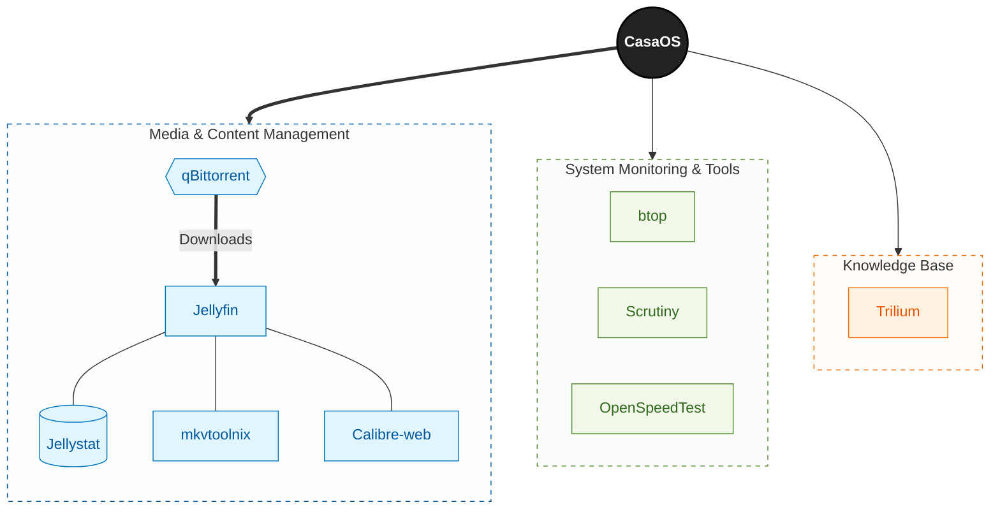

# 📦 Home Server Setup

A collection of configuration basics and essential services for a streamlined home server experience.

### 🖥️ CasaOS System Architecture

```mermaid
graph TD
    %% Main Entry
    CasaOS((<b>CasaOS</b>))

    %% Media & Content Cluster
    subgraph Media [Media & Content Management]
        direction TB
        QB{{qBittorrent}}
        JF[Jellyfin]
        JS[(Jellystat)]
        MKV[mkvtoolnix]
        CW[Calibre-web]

        QB ==>|Downloads| JF
        JF --- JS
        JF --- MKV
        JF --- CW
    end

    %% System & Network Cluster
    subgraph System [System Monitoring & Tools]
        direction LR
        BT[btop]
        SC[Scrutiny]
        OST[OpenSpeedTest]
    end

    %% Knowledge Cluster
    subgraph Knowledge [Knowledge Base]
        TR[Trilium]
    end

    %% Core Connections
    CasaOS ==> Media
    CasaOS --> System
    CasaOS --> Knowledge

    %% ==========================================
    %% 🎨 Stable CSS Styling
    %% ==========================================

    %% Node Classes
    classDef mainNode fill:#222,stroke:#000,stroke-width:2px,color:#fff
    classDef contentNode fill:#e1f5fe,stroke:#0277bd,stroke-width:1px,color:#01579b
    classDef systemNode fill:#f1f8e9,stroke:#558b2f,stroke-width:1px,color:#33691e
    classDef knowledgeNode fill:#fff3e0,stroke:#ef6c00,stroke-width:1px,color:#e65100

    %% Assign classes
    class CasaOS mainNode
    class JF,JS,MKV,CW,QB contentNode
    class BT,SC,OST systemNode
    class TR knowledgeNode

    %% Subgraph Styles
    style Media fill:#fbfdff,stroke:#01579b,stroke-dasharray: 5 5
    style System fill:#fafdfb,stroke:#558b2f,stroke-dasharray: 5 5
    style Knowledge fill:#fffcf9,stroke:#ef6c00,stroke-dasharray: 5 5

```

---

